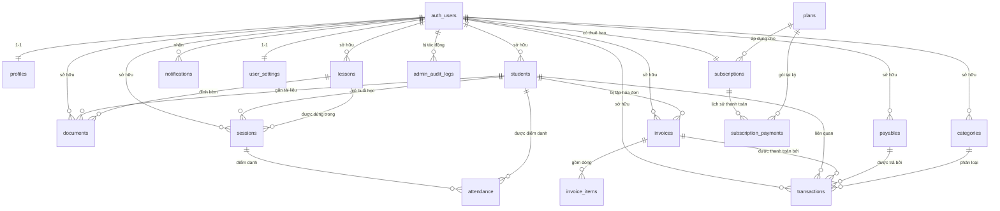

# DATABASE — Thiết kế cơ sở dữ liệu

**Phiên bản:** 1.0 · **Ngày:** 2026-07-13 · **Nền tảng:** Supabase PostgreSQL
Tài liệu mô tả schema, quan hệ, khóa ngoại, chỉ mục, chính sách RLS và Storage. Đây là **nguồn chân lý** cho cấu trúc dữ liệu; mọi migration phải bám theo (hoặc cập nhật) tài liệu này.

---

## 1. Nguyên tắc thiết kế

1. **Đa người thuê theo hàng (row-level multi-tenancy):** không tách schema/DB theo khách. Mọi bảng dữ liệu khách có `user_id` và được **RLS** cách ly.
2. **`user_id` là bắt buộc:** mọi bảng dữ liệu khách có `user_id uuid NOT NULL REFERENCES auth.users(id) ON DELETE CASCADE`, mặc định `auth.uid()`.
3. **RLS bật toàn bộ:** không có ngoại lệ cho bảng dữ liệu khách. Bảng thuê bao/nền tảng (`plans`, `subscriptions`, `subscription_payments`, `admin_audit_logs`) có policy riêng dựa trên `is_admin()`.
4. **Tài chính chính xác:** tiền lưu **số nguyên VND** (`bigint`, đơn vị "đồng"), không số thực (tránh sai số). Dòng tiền thực tế tập trung ở **một bảng `transactions`** để báo cáo nhất quán.
5. **Thời gian chuẩn hóa:** `timestamptz` (UTC), hiển thị theo `Asia/Ho_Chi_Minh` ở tầng ứng dụng.
6. **Bền vững dữ liệu:** ưu tiên **xóa mềm** (`archived_at`/trạng thái) cho dữ liệu tài chính & học sinh; hạn chế xóa cứng.
7. **Mở rộng có chủ đích:** điểm danh tách khỏi buổi học (`attendance`) để sau này hỗ trợ lớp nhóm nhiều học sinh mà không đổi cấu trúc lớn.

---

## 2. Quy ước chung

**Cột chuẩn có ở (gần như) mọi bảng dữ liệu khách:**

| Cột | Kiểu | Ghi chú |
|---|---|---|
| `id` | `uuid` | PK, mặc định `gen_random_uuid()` |
| `user_id` | `uuid` | `NOT NULL`, mặc định `auth.uid()`, FK → `auth.users(id)` `ON DELETE CASCADE` |
| `created_at` | `timestamptz` | mặc định `now()` |
| `updated_at` | `timestamptz` | mặc định `now()`, tự cập nhật bằng trigger |

**Kiểu dữ liệu quy ước:**
- Tiền: `bigint` (đồng VND, ≥ 0 với số tiền, có CHECK phù hợp).
- Chuỗi ngắn có tập giá trị cố định: **enum** (xem §4) hoặc `text` + `CHECK`.
- Ghi chú/nội dung dài: `text`. Nội dung định dạng phong phú của bài học: `text` (Markdown/HTML) hoặc `jsonb` nếu dùng editor cấu trúc.
- Cờ luận lý: `boolean`.

---

## 3. Sơ đồ quan hệ (ERD)



> `auth_users` là bảng do Supabase Auth quản lý (`auth.users`). Các bảng nghiệp vụ tham chiếu tới nó qua `user_id`.

---

## 4. Kiểu liệt kê (Enums)

```sql
create type subscription_status         as enum ('trialing','active','past_due','expired','cancelled');
create type billing_cycle               as enum ('monthly','yearly');
create type subscription_payment_status as enum ('pending','confirmed','failed','refunded');
create type subscription_event_kind     as enum ('activation','renewal','upgrade','downgrade');
create type admin_action                as enum ('activate_subscription','renew_subscription','change_plan','cancel_subscription','lock_account','unlock_account','update_account');
create type student_status      as enum ('active','paused','inactive');
create type session_status      as enum ('scheduled','completed','cancelled','no_show');
create type session_mode        as enum ('online','offline');
create type attendance_status   as enum ('present','absent','late','excused');
create type invoice_status      as enum ('draft','unpaid','partial','paid','overdue','cancelled');
create type payable_status      as enum ('unpaid','partial','paid','cancelled');
create type transaction_type    as enum ('income','expense');
create type category_kind       as enum ('income','expense');
create type payment_method      as enum ('cash','bank_transfer','e_wallet','other');
create type document_type       as enum ('file','link');
create type notification_type   as enum ('session_reminder','payment_due','payment_received','system');
```

> Vai trò (`user`/`admin`) **không** lưu trong bảng nghiệp vụ mà ở `auth.users.app_metadata.role` (xem `PERMISSIONS.md`). `profiles.role` (nếu có) chỉ là bản sao đọc-thôi để tiện hiển thị, do máy chủ đồng bộ.

---

## 5. Chi tiết các bảng

### 5.1. Nhóm Tài khoản & Nền tảng

#### `profiles` — hồ sơ USER (1-1 với `auth.users`)
| Cột | Kiểu | Ràng buộc / ghi chú |
|---|---|---|
| `id` | `uuid` | PK, **đồng thời** FK → `auth.users(id)` `ON DELETE CASCADE` (không dùng `user_id` riêng) |
| `full_name` | `text` | Tên giáo viên |
| `email` | `text` | Đồng bộ từ auth (tiện hiển thị) |
| `phone` | `text` | |
| `avatar_url` | `text` | Ảnh đại diện (Storage) |
| `role` | `text` | Bản sao đọc-thôi của `app_metadata.role` (mặc định `'user'`) |
| `is_locked` | `boolean` | Trạng thái khóa tài khoản; ADMIN khóa/mở; mặc định `false` |
| `created_at`, `updated_at` | `timestamptz` | |

> Thông tin thuê bao (gói, trạng thái, ngày bắt đầu/hết hạn) **không** nằm ở đây mà ở bảng **`subscriptions`** (bên dưới). `profiles` chỉ giữ thông tin tài khoản + cờ khóa.
> Được tạo tự động khi có user mới bằng trigger `on auth.users` (hoặc Server Action lúc onboarding). RLS: chủ hồ sơ đọc/sửa phần thông tin; `role`/`is_locked` chỉ máy chủ (`service_role`)/ADMIN đổi.

#### `user_settings` — cài đặt (1-1 với USER)
| Cột | Kiểu | Ghi chú |
|---|---|---|
| `user_id` | `uuid` | PK + FK → `auth.users(id)` |
| `currency` | `text` | mặc định `'VND'` |
| `timezone` | `text` | mặc định `'Asia/Ho_Chi_Minh'` |
| `locale` | `text` | mặc định `'vi'` |
| `date_format` | `text` | mặc định `'dd/MM/yyyy'` |
| `default_session_duration_min` | `int` | mặc định `90` |
| `notify_session_reminder` | `boolean` | mặc định `true` |
| `notify_payment_due` | `boolean` | mặc định `true` |
| `updated_at` | `timestamptz` | |

#### `plans` — danh mục gói thuê bao (nền tảng, ADMIN quản lý)
| Cột | Kiểu | Ghi chú |
|---|---|---|
| `id` | `uuid` | PK |
| `code` | `text` | duy nhất (`pro_monthly`, `pro_yearly`…) |
| `name` | `text` | Tên hiển thị |
| `description` | `text` | Mô tả gói (nullable) |
| `price` | `bigint` | VND cho một chu kỳ |
| `billing_cycle` | `billing_cycle` | `monthly`/`yearly` |
| `features` | `jsonb` | Giới hạn/tính năng |
| `is_active` | `boolean` | Đang mở bán |
| `sort_order` | `int` | Thứ tự hiển thị (mặc định 0) |
| `created_at`, `updated_at` | `timestamptz` | |

_Không có `user_id`._ RLS: USER đọc gói `is_active`; ADMIN toàn quyền. **Mô hình kinh doanh: thuê bao trả phí theo tháng hoặc năm.** MVP seed **một gói** ở 2 chu kỳ (ví dụ `pro_monthly`, `pro_yearly`); chưa có nhiều bậc hay gói miễn phí vĩnh viễn.

#### `subscriptions` — thuê bao của USER (1-1 với `auth.users`)
> Mỗi USER có đúng **một** bản ghi thuê bao, cập nhật qua thời gian (kích hoạt, gia hạn đẩy `expires_at`, đổi gói, hủy). Lịch sử từng lần thanh toán/kích hoạt/gia hạn nằm ở `subscription_payments`.

| Cột | Kiểu | Ghi chú |
|---|---|---|
| `id` | `uuid` | PK |
| `user_id` | `uuid` | **NOT NULL, UNIQUE**, FK → `auth.users(id)` `ON DELETE CASCADE` |
| `plan_id` | `uuid` | FK → `plans(id)` `ON DELETE SET NULL` (nullable khi đang `trialing`) |
| `status` | `subscription_status` | `trialing`/`active`/`past_due`/`expired`/`cancelled`; mặc định `'trialing'` |
| `billing_cycle` | `billing_cycle` | Chu kỳ đang áp dụng (nullable khi trial) |
| `trial_ends_at` | `timestamptz` | Hết hạn dùng thử |
| `started_at` | `timestamptz` | **Ngày bắt đầu** thuê bao trả phí (lần kích hoạt đầu tiên) |
| `expires_at` | `timestamptz` | **Ngày hết hạn** hiện hành (gia hạn sẽ đẩy ngày này) |
| `cancelled_at` | `timestamptz` | Thời điểm hủy (nullable) |
| `created_at`, `updated_at` | `timestamptz` | |

Chỉ mục: `(status)`, `(expires_at)`. RLS: USER **chỉ đọc** thuê bao của mình; tạo/sửa do ADMIN (`is_admin()`) hoặc máy chủ (`service_role`).

#### `subscription_payments` — lịch sử thanh toán / kích hoạt / gia hạn (nền tảng)
> Mỗi lần ADMIN xác nhận thanh toán (kích hoạt hoặc gia hạn) tạo một bản ghi ở đây, đồng thời cập nhật `subscriptions.expires_at`/`status`.

| Cột | Kiểu | Ghi chú |
|---|---|---|
| `id` | `uuid` | PK |
| `subscription_id` | `uuid` | FK → `subscriptions(id)` `ON DELETE CASCADE` |
| `user_id` | `uuid` | NOT NULL, FK → `auth.users(id)` (denormalized để lọc/RLS) |
| `plan_id` | `uuid` | FK → `plans(id)` `ON DELETE SET NULL` (gói tại thời điểm thanh toán) |
| `kind` | `subscription_event_kind` | `activation`/`renewal`/`upgrade`/`downgrade` |
| `amount` | `bigint` | Số tiền (VND) |
| `currency` | `text` | mặc định `'VND'` |
| `billing_cycle` | `billing_cycle` | Chu kỳ mua |
| `period_start` | `timestamptz` | Kỳ áp dụng — bắt đầu |
| `period_end` | `timestamptz` | Kỳ áp dụng — kết thúc |
| `status` | `subscription_payment_status` | `pending`/`confirmed`/`failed`/`refunded`; MVP chủ yếu `pending → confirmed` |
| `method` | `payment_method` | `cash`/`bank_transfer`/`e_wallet`/`other` |
| `reference` | `text` | Mã tham chiếu chuyển khoản |
| `confirmed_by` | `uuid` | ADMIN xác nhận (FK → `auth.users(id)`, nullable) |
| `confirmed_at` | `timestamptz` | Thời điểm xác nhận |
| `note` | `text` | |
| `created_at` | `timestamptz` | |

Chỉ mục: `(user_id)`, `(subscription_id)`, `(status)`. RLS: USER **chỉ đọc** bản ghi của mình; ghi/xác nhận do ADMIN (`is_admin()`/`service_role`).

#### `admin_audit_logs` — nhật ký hành động ADMIN (nền tảng)
> **Bắt buộc** ghi mọi thao tác: kích hoạt, gia hạn, đổi gói, hủy, **khóa**, **mở khóa** tài khoản.

| Cột | Kiểu | Ghi chú |
|---|---|---|
| `id` | `uuid` | PK |
| `actor_id` | `uuid` | **NOT NULL** — ADMIN thực hiện (FK → `auth.users(id)`) |
| `action` | `admin_action` | `activate_subscription`/`renew_subscription`/`change_plan`/`cancel_subscription`/`lock_account`/`unlock_account`/`update_account` |
| `target_user_id` | `uuid` | Tài khoản USER bị tác động (FK → `auth.users(id)`, nullable) |
| `target_subscription_id` | `uuid` | FK → `subscriptions(id)` (nullable) |
| `metadata` | `jsonb` | Dữ liệu kèm (giá trị trước/sau, số tiền, ngày…) |
| `ip_address` | `text` | (tùy chọn) |
| `created_at` | `timestamptz` | |

RLS: chỉ ADMIN đọc; ghi qua máy chủ (`service_role`). USER **không** truy cập.

---

### 5.2. Nhóm Học sinh & Giảng dạy

#### `students` — hồ sơ học sinh
| Cột | Kiểu | Ghi chú |
|---|---|---|
| `id` | `uuid` | PK |
| `user_id` | `uuid` | **NOT NULL**, FK → `auth.users(id)` |
| `full_name` | `text` | **NOT NULL** |
| `date_of_birth` | `date` | nullable |
| `gender` | `text` | `male`/`female`/`other` (nullable) |
| `grade_level` | `text` | Lớp/khối (vd "Lớp 9") |
| `subjects` | `text[]` | Danh sách môn |
| `phone` | `text` | SĐT học sinh |
| `email` | `text` | nullable |
| `parent_name` | `text` | Phụ huynh |
| `parent_phone` | `text` | |
| `address` | `text` | |
| `default_fee` | `bigint` | Học phí mặc định/buổi (VND) |
| `fee_type` | `text` | `per_session`/`per_month` (mặc định `per_session`) |
| `status` | `student_status` | mặc định `'active'` |
| `avatar_url` | `text` | Storage |
| `notes` | `text` | |
| `archived_at` | `timestamptz` | Xóa mềm (nullable) |
| `created_at`, `updated_at` | `timestamptz` | |

Chỉ mục: `(user_id)`, `(user_id, status)`, `(user_id, full_name)`.

#### `lessons` — bài học / nội dung giảng dạy (thư viện dùng chung của USER)
| Cột | Kiểu | Ghi chú |
|---|---|---|
| `id` | `uuid` | PK |
| `user_id` | `uuid` | NOT NULL, FK |
| `title` | `text` | NOT NULL |
| `subject` | `text` | Môn |
| `grade_level` | `text` | Khối |
| `description` | `text` | |
| `content` | `text` | Nội dung (Markdown/HTML) |
| `tags` | `text[]` | |
| `order_index` | `int` | Thứ tự sắp xếp |
| `status` | `text` | `draft`/`published` (mặc định `draft`) |
| `archived_at` | `timestamptz` | Xóa mềm |
| `created_at`, `updated_at` | `timestamptz` | |

Chỉ mục: `(user_id)`, `(user_id, subject)`.

#### `documents` — tài liệu, tệp & liên kết
| Cột | Kiểu | Ghi chú |
|---|---|---|
| `id` | `uuid` | PK |
| `user_id` | `uuid` | NOT NULL, FK |
| `title` | `text` | NOT NULL |
| `type` | `document_type` | `file`/`link` |
| `storage_path` | `text` | Đường dẫn Storage (nếu `file`), tiền tố `user_id/…` |
| `file_name` | `text` | Tên gốc |
| `file_size` | `bigint` | Byte |
| `mime_type` | `text` | |
| `url` | `text` | Nếu `link` (Google Drive, YouTube…) |
| `lesson_id` | `uuid` | FK → `lessons(id)` `ON DELETE SET NULL` (nullable) |
| `student_id` | `uuid` | FK → `students(id)` `ON DELETE SET NULL` (nullable) |
| `description` | `text` | |
| `created_at`, `updated_at` | `timestamptz` | |

Chỉ mục: `(user_id)`, `(user_id, lesson_id)`, `(user_id, student_id)`.

---

### 5.3. Nhóm Lịch & Buổi học

#### `sessions` — buổi học (lịch dạy + trạng thái)
| Cột | Kiểu | Ghi chú |
|---|---|---|
| `id` | `uuid` | PK |
| `user_id` | `uuid` | NOT NULL, FK |
| `student_id` | `uuid` | FK → `students(id)` `ON DELETE CASCADE` (MVP: 1 buổi ↔ 1 học sinh) |
| `lesson_id` | `uuid` | FK → `lessons(id)` `ON DELETE SET NULL` (nullable) |
| `title` | `text` | Tiêu đề buổi (nullable, có thể suy từ học sinh/môn) |
| `start_time` | `timestamptz` | NOT NULL |
| `end_time` | `timestamptz` | NOT NULL, CHECK `end_time > start_time` |
| `mode` | `session_mode` | `online`/`offline` (mặc định `offline`) |
| `location` | `text` | Địa điểm hoặc link học online |
| `status` | `session_status` | mặc định `'scheduled'` |
| `fee_amount` | `bigint` | Học phí buổi (mặc định lấy từ `students.default_fee`) |
| `is_billed` | `boolean` | Đã đưa vào hóa đơn chưa (mặc định `false`) |
| `cancel_reason` | `text` | Khi `cancelled` |
| `recurrence_group_id` | `uuid` | Gom các buổi cùng chuỗi lặp (P1, nullable) |
| `created_at`, `updated_at` | `timestamptz` | |

Chỉ mục: `(user_id, start_time)`, `(user_id, status)`, `(user_id, student_id)`.

#### `attendance` — điểm danh & ghi chú sau buổi
> Tách khỏi `sessions` để mở rộng lớp nhóm sau này. MVP (dạy 1-1): mỗi `session` có đúng 1 bản ghi `attendance`.

| Cột | Kiểu | Ghi chú |
|---|---|---|
| `id` | `uuid` | PK |
| `user_id` | `uuid` | NOT NULL, FK |
| `session_id` | `uuid` | FK → `sessions(id)` `ON DELETE CASCADE` |
| `student_id` | `uuid` | FK → `students(id)` `ON DELETE CASCADE` |
| `status` | `attendance_status` | `present`/`absent`/`late`/`excused` |
| `homework_done` | `boolean` | Tình trạng bài tập (nullable) |
| `note` | `text` | Nhận xét sau buổi (đã dạy gì, đánh giá, việc cần làm) |
| `created_at`, `updated_at` | `timestamptz` | |

Ràng buộc: `UNIQUE (session_id, student_id)`. Chỉ mục: `(user_id, student_id)`.

---

### 5.4. Nhóm Tài chính

> **Mô hình:** `invoices` = khoản **phải thu** (accrual). `payables` = khoản **phải trả** (accrual). `transactions` = **dòng tiền thực tế** (mọi khoản thu/chi). Một `transaction` có thể gắn tùy chọn tới một `invoice` (thu học phí) hoặc một `payable` (trả nợ) hoặc không gắn gì (thu/chi khác). Nhờ đó **báo cáo dòng tiền chỉ cần đọc `transactions`**, còn công nợ tính từ `invoices`/`payables`.

#### `categories` — danh mục thu/chi
| Cột | Kiểu | Ghi chú |
|---|---|---|
| `id` | `uuid` | PK |
| `user_id` | `uuid` | NOT NULL, FK |
| `kind` | `category_kind` | `income`/`expense` |
| `name` | `text` | vd "Học phí", "Thuê phòng", "Mua tài liệu" |
| `is_archived` | `boolean` | mặc định `false` |
| `created_at`, `updated_at` | `timestamptz` | |

Ràng buộc: `UNIQUE (user_id, kind, name)`.

#### `invoices` — hóa đơn / khoản phải thu (học phí)
| Cột | Kiểu | Ghi chú |
|---|---|---|
| `id` | `uuid` | PK |
| `user_id` | `uuid` | NOT NULL, FK |
| `student_id` | `uuid` | FK → `students(id)` `ON DELETE RESTRICT` |
| `code` | `text` | Mã hóa đơn (tùy chọn, sinh theo USER) |
| `title` | `text` | vd "Học phí tháng 07/2026" |
| `period_month` | `date` | Kỳ áp dụng (ngày đầu tháng) |
| `subtotal` | `bigint` | Tổng trước giảm |
| `discount` | `bigint` | Giảm giá (mặc định 0) |
| `total_amount` | `bigint` | `= subtotal - discount` (CHECK ≥ 0) |
| `amount_paid` | `bigint` | Cache tổng đã thu (cập nhật bằng trigger từ `transactions`) |
| `status` | `invoice_status` | mặc định `'unpaid'` |
| `issue_date` | `date` | Ngày lập |
| `due_date` | `date` | Hạn thanh toán |
| `note` | `text` | |
| `created_at`, `updated_at` | `timestamptz` | |

Chỉ mục: `(user_id, status)`, `(user_id, student_id)`, `(user_id, due_date)`.

#### `invoice_items` — dòng chi tiết hóa đơn
| Cột | Kiểu | Ghi chú |
|---|---|---|
| `id` | `uuid` | PK |
| `user_id` | `uuid` | NOT NULL, FK |
| `invoice_id` | `uuid` | FK → `invoices(id)` `ON DELETE CASCADE` |
| `session_id` | `uuid` | FK → `sessions(id)` `ON DELETE SET NULL` (nullable — khi tổng hợp từ buổi) |
| `description` | `text` | |
| `quantity` | `numeric` | mặc định 1 |
| `unit_price` | `bigint` | VND |
| `amount` | `bigint` | `= quantity * unit_price` |

> **Dùng ở MVP** để **tổng hợp hóa đơn tự động** từ các buổi đã hoàn thành: mỗi buổi đưa vào hóa đơn tạo một dòng (`session_id`, học phí buổi) và đặt `sessions.is_billed = true` (tránh tính trùng). Vẫn cho phép thêm dòng thủ công / nhập `total_amount` trực tiếp cho hóa đơn tạo tay.

#### `payables` — khoản phải trả (USER nợ người khác)
| Cột | Kiểu | Ghi chú |
|---|---|---|
| `id` | `uuid` | PK |
| `user_id` | `uuid` | NOT NULL, FK |
| `creditor_name` | `text` | Chủ nợ (người/đơn vị) |
| `category_id` | `uuid` | FK → `categories(id)` (kind=expense, nullable) |
| `title` | `text` | Mô tả khoản nợ |
| `total_amount` | `bigint` | Tổng phải trả (CHECK ≥ 0) |
| `amount_paid` | `bigint` | Cache đã trả (trigger từ `transactions`) |
| `status` | `payable_status` | mặc định `'unpaid'` |
| `due_date` | `date` | Hạn trả |
| `note` | `text` | |
| `created_at`, `updated_at` | `timestamptz` | |

Chỉ mục: `(user_id, status)`, `(user_id, due_date)`.

#### `transactions` — dòng tiền thực tế (thu & chi thống nhất)
| Cột | Kiểu | Ghi chú |
|---|---|---|
| `id` | `uuid` | PK |
| `user_id` | `uuid` | NOT NULL, FK |
| `type` | `transaction_type` | `income`/`expense` |
| `amount` | `bigint` | > 0 (CHECK) |
| `occurred_at` | `timestamptz` | Thời điểm dòng tiền thực tế |
| `method` | `payment_method` | `cash`/`bank_transfer`/`e_wallet`/`other` |
| `category_id` | `uuid` | FK → `categories(id)` (nullable) |
| `student_id` | `uuid` | FK → `students(id)` `ON DELETE SET NULL` (nullable) |
| `invoice_id` | `uuid` | FK → `invoices(id)` `ON DELETE SET NULL` — set khi **thu học phí** |
| `payable_id` | `uuid` | FK → `payables(id)` `ON DELETE SET NULL` — set khi **trả nợ** |
| `reference` | `text` | Mã tham chiếu (số CT chuyển khoản…) |
| `note` | `text` | |
| `created_at`, `updated_at` | `timestamptz` | |

Ràng buộc gợi ý: `CHECK (invoice_id IS NULL OR type = 'income')`, `CHECK (payable_id IS NULL OR type = 'expense')`.
Chỉ mục: `(user_id, occurred_at)`, `(user_id, type)`, `(user_id, invoice_id)`, `(user_id, payable_id)`.

**Quy tắc nghiệp vụ:**
- Thu học phí → `insert transactions(type='income', invoice_id=…, student_id=…)` → trigger cập nhật `invoices.amount_paid` + `status`.
- Trả nợ → `insert transactions(type='expense', payable_id=…)` → trigger cập nhật `payables.amount_paid` + `status`.
- Thu/chi khác → `transactions` với `category_id`, không gắn invoice/payable.

---

### 5.5. Nhóm Hệ thống

#### `notifications` — thông báo trong ứng dụng
| Cột | Kiểu | Ghi chú |
|---|---|---|
| `id` | `uuid` | PK |
| `user_id` | `uuid` | NOT NULL, FK |
| `type` | `notification_type` | |
| `title` | `text` | |
| `body` | `text` | |
| `entity_type` | `text` | vd `session`/`invoice` (nullable) |
| `entity_id` | `uuid` | ID đối tượng liên quan (nullable) |
| `is_read` | `boolean` | mặc định `false` |
| `created_at` | `timestamptz` | |

Chỉ mục: `(user_id, is_read)`, `(user_id, created_at)`.

---

## 6. Tổng hợp khóa ngoại

| Bảng | Cột | Tham chiếu | Khi xóa cha |
|---|---|---|---|
| `profiles` | `id` | `auth.users(id)` | CASCADE |
| `subscriptions` | `user_id` | `auth.users(id)` | CASCADE |
| `subscriptions` | `plan_id` | `plans(id)` | SET NULL |
| `subscription_payments` | `subscription_id` | `subscriptions(id)` | CASCADE |
| `subscription_payments` | `user_id` | `auth.users(id)` | CASCADE |
| `subscription_payments` | `plan_id` | `plans(id)` | SET NULL |
| `subscription_payments` | `confirmed_by` | `auth.users(id)` | SET NULL |
| `user_settings` | `user_id` | `auth.users(id)` | CASCADE |
| tất cả bảng khách | `user_id` | `auth.users(id)` | CASCADE |
| `documents` | `lesson_id` | `lessons(id)` | SET NULL |
| `documents` | `student_id` | `students(id)` | SET NULL |
| `sessions` | `student_id` | `students(id)` | CASCADE |
| `sessions` | `lesson_id` | `lessons(id)` | SET NULL |
| `attendance` | `session_id` | `sessions(id)` | CASCADE |
| `attendance` | `student_id` | `students(id)` | CASCADE |
| `invoices` | `student_id` | `students(id)` | RESTRICT |
| `invoice_items` | `invoice_id` | `invoices(id)` | CASCADE |
| `invoice_items` | `session_id` | `sessions(id)` | SET NULL |
| `payables` | `category_id` | `categories(id)` | SET NULL |
| `transactions` | `invoice_id` | `invoices(id)` | SET NULL |
| `transactions` | `payable_id` | `payables(id)` | SET NULL |
| `transactions` | `student_id` | `students(id)` | SET NULL |
| `transactions` | `category_id` | `categories(id)` | SET NULL |
| `admin_audit_logs` | `actor_id` | `auth.users(id)` | RESTRICT (giữ log) |
| `admin_audit_logs` | `target_user_id` | `auth.users(id)` | SET NULL |
| `admin_audit_logs` | `target_subscription_id` | `subscriptions(id)` | SET NULL |

> Lưu ý: xóa học sinh có hóa đơn bị **RESTRICT** để không mất dấu công nợ; hãy dùng xóa mềm (`archived_at`) thay vì xóa cứng.

---

## 7. Row Level Security (RLS)

**Quy tắc chung — áp cho MỌI bảng dữ liệu khách** (`students`, `lessons`, `documents`, `sessions`, `attendance`, `categories`, `invoices`, `invoice_items`, `payables`, `transactions`, `notifications`, `user_settings`):

```sql
alter table public.<tbl> enable row level security;

create policy "<tbl>_select_own" on public.<tbl>
  for select using ( auth.uid() = user_id );

create policy "<tbl>_insert_own" on public.<tbl>
  for insert with check ( auth.uid() = user_id );

create policy "<tbl>_update_own" on public.<tbl>
  for update using ( auth.uid() = user_id ) with check ( auth.uid() = user_id );

create policy "<tbl>_delete_own" on public.<tbl>
  for delete using ( auth.uid() = user_id );
```

**`profiles`** (đặc thù — cột nhạy cảm chỉ máy chủ/ADMIN đổi):
```sql
alter table public.profiles enable row level security;

create policy "profiles_select_own" on public.profiles
  for select using ( auth.uid() = id or public.is_admin() );

create policy "profiles_update_own_basic" on public.profiles
  for update using ( auth.uid() = id ) with check ( auth.uid() = id );
-- Việc đổi role/subscription_status/is_locked KHÔNG cấp cho USER:
-- thực hiện bằng service_role ở máy chủ (bỏ qua RLS) hoặc policy riêng cho is_admin().
```

**Bảng thuê bao & nền tảng:**
- `plans`: USER đọc bản ghi `is_active`; ADMIN (`is_admin()`) toàn quyền.
- `subscriptions`, `subscription_payments`: **USER chỉ ĐỌC bản ghi của chính mình** (`auth.uid() = user_id`) — không được sửa; tạo/cập nhật/xác nhận do ADMIN (`is_admin()`) hoặc máy chủ (`service_role`).
- `admin_audit_logs`: **chỉ ADMIN** đọc; USER không truy cập.

```sql
-- USER chỉ đọc thuê bao của mình; ADMIN quản lý
alter table public.subscriptions enable row level security;

create policy "subscriptions_select_own_or_admin" on public.subscriptions
  for select using ( auth.uid() = user_id or public.is_admin() );

create policy "subscriptions_admin_write" on public.subscriptions
  for all using ( public.is_admin() ) with check ( public.is_admin() );
-- (Thao tác của ADMIN chạy ở máy chủ; service_role bỏ qua RLS khi cần.)
```

> ⚠️ **ADMIN KHÔNG có quyền trên dữ liệu nghiệp vụ.** Policy của `students`, `lessons`, `documents`, `sessions`, `attendance`, `categories`, `invoices`, `invoice_items`, `payables`, `transactions`, `notifications`, `user_settings` **chỉ** dùng `auth.uid() = user_id`, **KHÔNG** có nhánh `is_admin()`. Do đó ngay cả tài khoản ADMIN cũng **không** đọc/sửa được **học sinh, bài học, lịch dạy, tài liệu, công nợ, thu nhập & chi phí** của USER qua RLS. Chỉ `service_role` mới bỏ qua RLS — và ta **không** dùng nó để truy cập dữ liệu nghiệp vụ của USER.

> Vì mọi bảng khách đều mặc định `user_id = auth.uid()` và policy `insert` yêu cầu `auth.uid() = user_id`, client **không thể** giả mạo `user_id` của người khác.

---

## 8. Trigger & tự động hóa

1. **`updated_at`** — trigger `moddatetime`/hàm tùy biến cập nhật `updated_at = now()` mỗi lần UPDATE.
2. **Tạo `profiles` + `user_settings`** khi có user mới:
   ```sql
   -- trigger AFTER INSERT ON auth.users → tạo profiles(id, ...) & user_settings(user_id, ...)
   ```
3. **Cập nhật công nợ theo dòng tiền** — trigger trên `transactions` (INSERT/UPDATE/DELETE):
   - Nếu `invoice_id` không null: tính lại `invoices.amount_paid = SUM(transactions.amount where invoice_id = ... and type='income')`, rồi đặt `status`:
     `paid` nếu `amount_paid >= total_amount`; `partial` nếu `0 < amount_paid < total`; ngược lại giữ `unpaid`.
   - Tương tự cho `payables` với `payable_id` và `type='expense'`.
4. **Đánh dấu quá hạn** — công việc định kỳ (Vercel Cron/Supabase scheduled) đặt `invoice.status='overdue'` khi `due_date < today` và chưa `paid`. (P1)

---

## 9. Views báo cáo (gợi ý)

Tất cả view kế thừa RLS của bảng cơ sở (dùng `security_invoker = true` để view chạy theo quyền người gọi).

- **`v_cashflow_monthly`** — tổng thu/chi/ròng theo tháng từ `transactions`:
  ```sql
  create view public.v_cashflow_monthly with (security_invoker = true) as
  select
    user_id,
    date_trunc('month', occurred_at) as month,
    sum(amount) filter (where type = 'income')  as total_income,
    sum(amount) filter (where type = 'expense') as total_expense,
    sum(amount) filter (where type = 'income')
      - sum(amount) filter (where type = 'expense') as net_cashflow
  from public.transactions
  group by user_id, date_trunc('month', occurred_at);
  ```
- **`v_receivables_outstanding`** — công nợ phải thu còn lại theo học sinh: `SUM(total_amount - amount_paid)` từ `invoices` chưa `paid/cancelled`.
- **`v_payables_outstanding`** — công nợ phải trả còn lại từ `payables`.
- **`v_upcoming_sessions`** — buổi `scheduled` trong 7 ngày tới.
- **`v_revenue_by_student`** (P1) — doanh thu theo học sinh từ `transactions type='income'`.

---

## 10. Supabase Storage

**Bucket:** `documents` (riêng tư, không public).

**Quy ước đường dẫn:** `"{user_id}/{document_id}/{file_name}"` — luôn bắt đầu bằng `user_id` để chính sách so khớp.

**Chính sách Storage (RLS trên `storage.objects`):**
```sql
-- Chỉ chủ sở hữu thao tác tệp trong tiền tố user_id của mình
create policy "documents_read_own"
on storage.objects for select
using ( bucket_id = 'documents' and (storage.foldername(name))[1] = auth.uid()::text );

create policy "documents_write_own"
on storage.objects for insert
with check ( bucket_id = 'documents' and (storage.foldername(name))[1] = auth.uid()::text );

create policy "documents_update_own"
on storage.objects for update
using ( bucket_id = 'documents' and (storage.foldername(name))[1] = auth.uid()::text );

create policy "documents_delete_own"
on storage.objects for delete
using ( bucket_id = 'documents' and (storage.foldername(name))[1] = auth.uid()::text );
```
- Ảnh đại diện (`avatar_url`) có thể để bucket `avatars` với chính sách tương tự (hoặc public-read nếu chấp nhận).
- Tải/đọc tệp qua **signed URL** phát hành ở máy chủ để kiểm soát thời hạn.

---

## 11. Chiến lược migration & seed

1. **Thứ tự migration:** enums → `plans` → `profiles`/`user_settings` + trigger auth → `subscriptions`/`subscription_payments` → `admin_audit_logs` → bảng học sinh/giảng dạy → lịch/buổi → tài chính → hệ thống → views → RLS policies → Storage policies.
2. **Versioned SQL** trong repo (`supabase/migrations/*.sql`); không sửa schema thủ công trên dashboard mà không đưa vào migration.
3. **Seed dữ liệu mẫu (chỉ dev):** vài học sinh, buổi học, hóa đơn để kiểm thử báo cáo — **không** dùng ở production.
4. **Kiểm thử RLS tự động** theo `PERMISSIONS.md §8` là bước bắt buộc trong CI trước khi phát hành.

---

## 12. Cách ly dữ liệu — tóm tắt bắt buộc

- ✅ Mọi bảng khách có `user_id NOT NULL DEFAULT auth.uid()`.
- ✅ RLS bật; policy `auth.uid() = user_id`.
- ✅ Không nhận `user_id` từ client.
- ✅ Tệp Storage cách ly theo tiền tố `user_id/`.
- ✅ Bảng nền tảng dùng `is_admin()` (JWT claim), không truy vấn bảng gây đệ quy.
- ✅ Kiểm thử cách ly (đọc/ghi chéo, giả mạo id, leo thang vai trò) đạt **0 rò rỉ** trước khi phát hành.

---

## 13. Tài liệu liên quan
- [`PRD.md`](./PRD.md) · [`PERMISSIONS.md`](./PERMISSIONS.md) · [`ROADMAP.md`](./ROADMAP.md)
